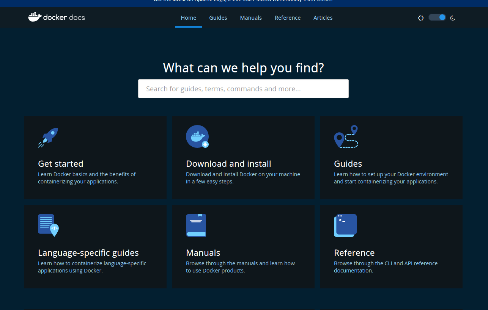
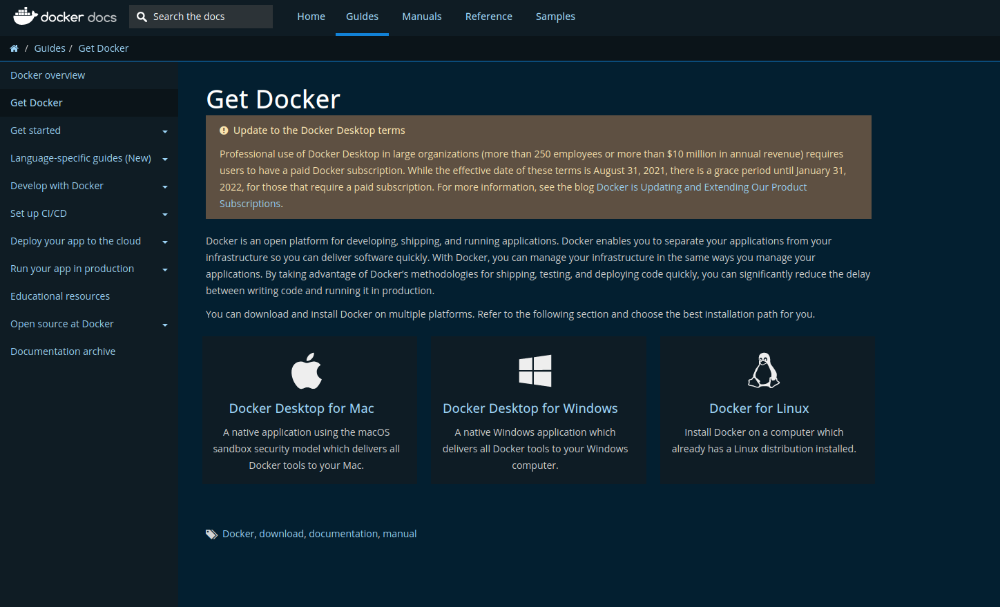

# Docker installation
먼저 도커를 내 운영체제에 설치해야 한다. **docker docs**에 접속하여 자신의 운영체제에 맞는 도커를 설치하자. 아래 이미지는 해당 docker docs에 접속한 화면이다.
여기서 'Download and install'를 클릭하여 다운로드 화면으로 넘어가자.

</br>



</br>
다음 화면에서는 각각의 운영체제에 따른 Docker 설치 방법이다. 저자는 unbuntu 18.02 lTS 버전을 사용하고 있으므로 'Docker for Linux'로 도커를 설치했다.

</br>



</br>
</br>

# uninstall old versions

다음 명령어를 이용하여 구버전의 도커를 삭제하자.
```
heeyang@heeyang-930QBE:~$ sudo apt-get remove docker docker-engine docker.io containerd runc
[sudo] heeyang의 암호: 
패키지 목록을 읽는 중입니다... 완료
의존성 트리를 만드는 중입니다       
상태 정보를 읽는 중입니다... 완료
패키지 'docker-engine'는 설치되어 있지 않아, 지우지 않았습니다.
패키지 'docker'는 설치되어 있지 않아, 지우지 않았습니다.
패키지 'containerd'는 설치되어 있지 않아, 지우지 않았습니다.
패키지 'docker.io'는 설치되어 있지 않아, 지우지 않았습니다.
패키지 'runc'는 설치되어 있지 않아, 지우지 않았습니다.
```

이러한 패키지가 설치되어 있지 않다고 apt-get에서 알려줘도 괜찮다.
이미지, 컨테이너, 볼륨 및 네트워크를 포함한 /var/lib/docker/의 내용들은 보존된다.


# Supported storage drivers
지원되는 저장 드라이버(storage drivers)

우분투의 도커 엔진은 ```overlay2```, ```aufs``` 및 ```btrfs``` 저장소 드라이버를 지원한다.

도커 엔진은 기본적으로 ```overlay2``` 저장소 드라이버를 사용한다. 대신 ```aufs```를 사용해야 하는 경우 수동으로 구성해야 한다. AUFS 저장소 드라이버를 사용하려면 docker docs를 참고하자.

# 설치 방법
필요에 따라 다양한 방법으로 도커 엔진을 설치할 수 있다.

1. 대부분의 사용자는 설치 및 업그레이드 작업을 쉽게 하기 위해 도커의 리포지토리를 설정하고 이 리포지토리에 도커를 설치한다. (현재 권장되는 접근 방식입니다.)

2. 일부 사용자는 DEB 패키지를 다운로드하여 수동으로 설치하고 업그레이드를 완전히 수동으로 관리한다. 이는 인터넷에 접속할 수 없는 에어 갭 시스템에 도커를 설치하는 것과 같은 상황에서 유용하다.

3. 테스트 및 개발 환경에서 일부 사용자는 도커를 설치하기 위해 자동화된 편의 스크립트를 사용한다.

여기서는 Docker docs에서 권장하는 '1번'방법으로 설치해보자.

# 리포지토리를 사용하여 설치

new host system에 Docker Engine을 처음 설치하기 전에 Docker repository를 설정해야 한다. 이 repository에서는 docker를 설치하고 업데이트할 수 있다.


## Repository 설정
1. apt를 통해 패키지와 패키지 정보를 업데이트하고 repository가 HTTPS에서 사용할 수 있도록 다음 패키지들을 설치한다.

    ```
     $ sudo apt-get update

     $ sudo apt-get install \
        ca-certificates \
        curl \
        gnupg \
        lsb-release
        패키지 목록을 읽는 중입니다... 완료
        의존성 트리를 만드는 중입니다       
        상태 정보를 읽는 중입니다... 완료  
        패키지 lsb-release는 이미 최신 버전입니다 (9.20170808ubuntu1).
        lsb-release 패키지는 수동설치로 지정합니다. 
        패키지 ca-certificates는 이미 최신 버전입니다 (20210119~18.04.2).
        패키지 curl는 이미 최신 버전입니다 (7.58.0-2ubuntu3.16).    
        패키지 gnupg는 이미 최신 버전입니다 (2.2.4-1ubuntu1.4).
        gnupg 패키지는 수동설치로 지정합니다.

    ```
2. Docker 공식 GPG Key를 추가한다.

    ```
    $ curl -fsSL https://download.docker.com/linux/ubuntu/gpg | sudo gpg --dearmor -o /usr/share/keyrings/docker-archive-keyring.gpg
    ```

3. 다음 명령어를 사용하여 안정한 repository를 설정한다. ```nightly```또는 ```test``` repository를 추가하려면 아래 명령에서 ```stable``` 단어 뒤에 nightly 또는 test를 추가하면 된다. nightly 및 test에 대해 더 알아보고 싶다면 docker docs에서 참고하자. 

    ```
     echo \
     "deb [arch=$(dpkg --print-architecture) signed-by=/usr/share/keyrings/docker-archive-keyring.gpg] https://download.docker.com/linux/ubuntu \
     $(lsb_release -cs) stable" | sudo tee /etc/apt/sources.list.d/docker.list > /dev/null
    ```

## Docker Engine 설치

1. apt를 통해 패키지와 패키지 정보를 업데이트하고 가장 최근의 Docker Engine 및 containerd 패키지들을 설치한다.

    ```
    $ sudo apt-get update
    ```

    나의 경우 몇몇 패키지들이 최신 버전으로 설치되어 있었다.

    ```
    heeyang@heeyang-930QBE:~$ sudo apt-get install docker-ce docker-ce-cli containerd.io
    패키지 목록을 읽는 중입니다... 완료
    의존성 트리를 만드는 중입니다       
    상태 정보를 읽는 중입니다... 완료
    패키지 containerd.io는 이미 최신 버전입니다 (1.4.12-1).
    containerd.io 패키지는 수동설치로 지정합니다.
    패키지 docker-ce-cli는 이미 최신 버전입니다 (5:20.10.12~3-0~ubuntu-bionic).
    패키지 docker-ce는 이미 최신 버전입니다 (5:20.10.12~3-0~ubuntu-bionic).

    ```

    **docker repository가 여러 개라면?**
여러 도커 리포지토리를 사용하도록 설정한 경우, apt-get install 또는 apt-get update 명령에 버전을 지정하지 않고 설치하거나 업데이트하면 항상 가능한 가장 높은 버전이 설치된다. 이는 안정성 요구 사항에 적합하지 않을 수 있으니 유의하자.
 
<br/>


2. 특정 버전의 Docker Engine을 설치하려면 repo에 사용 가능한 버전 중 하나를 선택하여 설치한다.

    a. repo에서 사용가능한 버전들을 나열한다.
    ```
    $ apt-cache madison docker-ce
    ```

    저자의 경우는 다음과 같은 버전들이 나열된다.
    ```
    heeyang@heeyang-930QBE:~$ apt-cache madison docker-ce
    docker-ce | 5:20.10.12~3-0~ubuntu-bionic | https://download.docker.com/linux/ubuntu bionic/stable amd64 Packages
    docker-ce | 5:20.10.11~3-0~ubuntu-bionic | https://download.docker.com/linux/ubuntu bionic/stable amd64 Packages
    docker-ce | 5:20.10.10~3-0~ubuntu-bionic | https://download.docker.com/linux/ubuntu bionic/stable amd64 Packages
    docker-ce | 5:20.10.9~3-0~ubuntu-bionic | https://download.docker.com/linux/ubuntu bionic/stable amd64 Packages
    docker-ce | 5:20.10.8~3-0~ubuntu-bionic | https://download.docker.com/linux/ubuntu bionic/stable amd64 Package
    ```

    b. 두 번째 줄에 해당하는 버전을 설치한다. 나의 경우에는 ```5:20.10.12~3-0~ubuntu-bionic```로 버전을 적어주었다.

    ```
     sudo apt-get install docker-ce=5:20.10.12~3-0~ubuntu-bionic docker-ce-cli=5:20.10.12~3-0~ubuntu-bionic containerd.io 
    ```

3. ```hello-world``` 이미지를 실행하여 Docker Engine이 올바르게 설치되었는지 확인한다.

    ```
    $ sudo docker run hello-world
    ```
    이 명령은 테스트 이미지를 다운로드하여 컨테이너에서 실행한다. 컨테이너가 실행되면 메시지를 인쇄하고 종료한다. 다음은 내 화면에서 출력된 결과다.
    
    ```
    # 윗 내용은 생략...
    Hello from Docker!
    This message shows that your installation appears to be working correctly.

    To generate this message, Docker took the following steps:
     1. The Docker client contacted the Docker daemon.
     2. The Docker daemon pulled the "hello-world" image from the Docker Hub.
    (amd64)
     3. The Docker daemon created a new container from that image which runs the
    executable that produces the output you are currently reading.
     4. The Docker daemon streamed that output to the Docker client, which sent it
    to your terminal.

    To try something more ambitious, you can run an Ubuntu container with:
     $ docker run -it ubuntu bash

    Share images, automate workflows, and more with a free Docker ID:
     https://hub.docker.com/

    For more examples and ideas, visit:
     https://docs.docker.com/get-started/
    ```

## Docker Engine 업그레이드
Docker Engine을 업그레이드 하려면 `sudo apt-get update`를 실행시킨다. 그리고 위에서 'Docker Engine 설치'를 참고하여 자신이 원하는 버전을 선택하여 설치한다.


